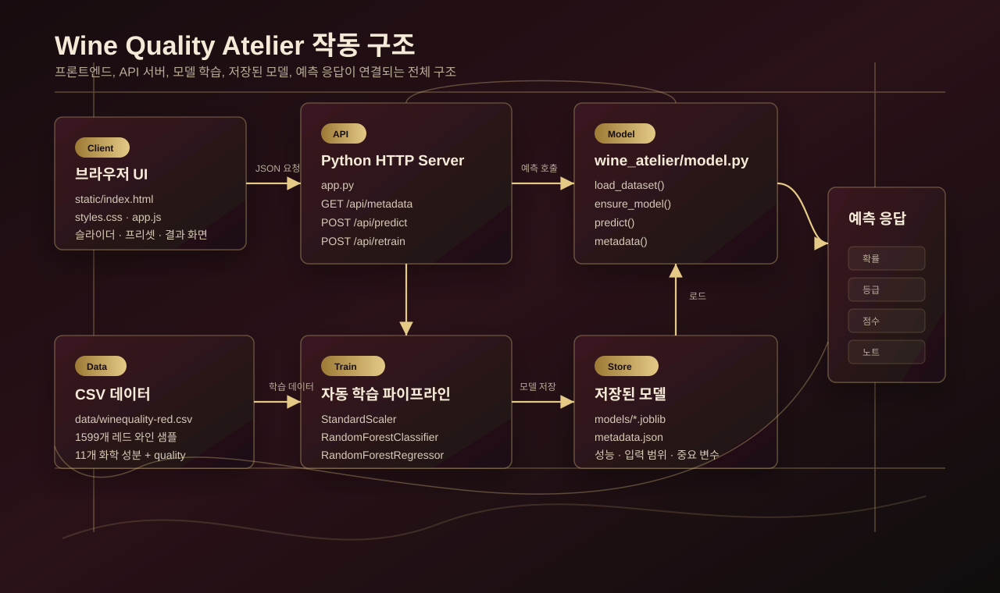
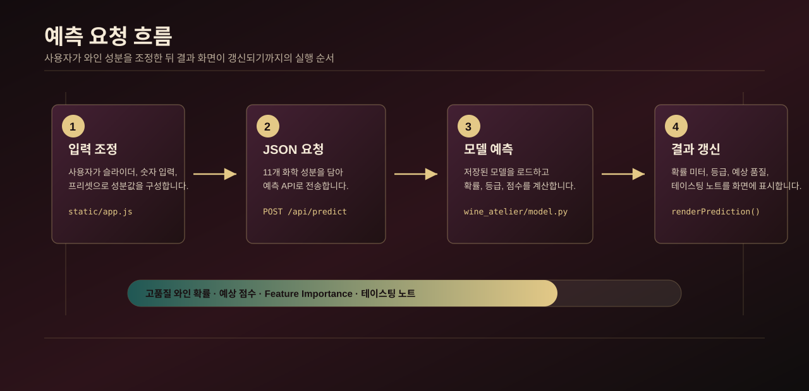

# Wine Quality Atelier

Tech Stack :  
HTML · CSS · JavaScript · Python · scikit-learn · Random Forest · REST API · Web Design

와인의 화학 성분 데이터를 기반으로 품질을 예측하는 프리미엄 와인샵 콘셉트의 AI 품질 분석 웹 서비스입니다.  
단순한 머신러닝 예측 페이지가 아니라, 사용자가 와인을 큐레이션하고 감별받는 고급 셀러 경험처럼 느껴지도록 전체 UI를 구성했습니다.  
와인 성분 조정, 빈티지 프리셋 선택, 품질 확률 예측, 예상 등급, 주요 영향 변수 시각화를 중심으로 AI 분석 기능과 감성적인 브랜드 경험을 함께 설계했습니다.

## 작동 구조





## 주요 기능

- 와인 화학 성분 11개 값을 슬라이더와 숫자 입력으로 직접 조정
- House Median, Private Reserve, Grand Cellar, Sharp Table Red 프리셋 제공
- Random Forest 기반 고품질 와인 확률 예측
- 예상 품질 점수, 등급, 테이스팅 노트 자동 생성
- 모델이 중요하게 보는 성분을 Feature Importance로 시각화
- 저장된 모델이 없으면 앱 시작 시 CSV 데이터로 자동 학습
- 외부 프레임워크 없이 Python 표준 라이브러리 서버로 실행

## 프로젝트 구조

```text
wine-quality-atelier/
├── app.py                         # 정적 파일 서버 + REST API
├── data/
│   └── winequality-red.csv         # 와인 품질 학습 데이터
├── docs/
│   ├── prediction-flow.svg         # 예측 요청 흐름 다이어그램
│   └── system-architecture.svg     # 전체 작동 구조 다이어그램
├── static/
│   ├── index.html                  # 웹 UI
│   ├── styles.css                  # 와인샵 콘셉트 스타일
│   ├── app.js                      # 프론트엔드 상태 관리/API 호출
│   └── assets/
│       └── cellar.png              # 로컬 생성 셀러 비주얼
├── tests/
│   └── test_model.py               # 모델 메타데이터/예측 테스트
├── tools/
│   └── generate_cellar_asset.py    # 셀러 이미지 생성 스크립트
└── wine_atelier/
    └── model.py                    # 데이터 로드, 학습, 저장, 예측 로직
```

## 실행 방법

```powershell
python -m pip install -r requirements.txt
python app.py
```

브라우저에서 아래 주소를 엽니다.

```text
http://127.0.0.1:8765
```

`models/wine_quality_bundle.joblib` 파일이 없으면 앱 시작 시 자동으로 모델을 학습하고 저장합니다.

## API

| Method | Endpoint | 설명 |
|---|---|---|
| GET | `/api/health` | 서버와 모델 준비 상태 확인 |
| GET | `/api/metadata` | 모델 성능, 입력 범위, 프리셋, 중요 변수 조회 |
| POST | `/api/predict` | 와인 성분 기반 품질 예측 |
| POST | `/api/retrain` | CSV 데이터로 모델 재학습 |

`POST /api/predict` 요청 예시:

```json
{
  "fixed acidity": 7.4,
  "volatile acidity": 0.7,
  "citric acid": 0.0,
  "residual sugar": 1.9,
  "chlorides": 0.076,
  "free sulfur dioxide": 11,
  "total sulfur dioxide": 34,
  "density": 0.9978,
  "pH": 3.51,
  "sulphates": 0.56,
  "alcohol": 9.4
}
```

응답 예시:

```json
{
  "highQualityProbability": 0.8445,
  "predictedClass": 1,
  "predictedQuality": 5.92,
  "tier": "Private Reserve",
  "notes": [
    "Lower alcohol keeps the model cautious.",
    "Volatile acidity is the main pressure point.",
    "Sulphates add structure in this profile.",
    "The profile sits near the stronger half of the training cellar."
  ]
}
```

## 모델 구성

- 데이터: `data/winequality-red.csv`
- 입력 변수: fixed acidity, volatile acidity, citric acid, residual sugar, chlorides, free sulfur dioxide, total sulfur dioxide, density, pH, sulphates, alcohol
- 분류 기준: `quality >= 6`이면 고품질 와인
- 분류 모델: `RandomForestClassifier`
- 점수 예측 모델: `RandomForestRegressor`
- 전처리: `StandardScaler`
- 검증 성능: Accuracy `0.80`, ROC AUC `0.8912`, F1 `0.8072`

## 테스트

```powershell
python -m unittest discover -s tests
```

## 원본 데이터

이 프로젝트의 데이터셋은 아래 로컬 파일을 기반으로 복사했습니다.

```text
C:\Users\lucky\Downloads\머신러닝 프로젝트\winequality-red.csv
```

